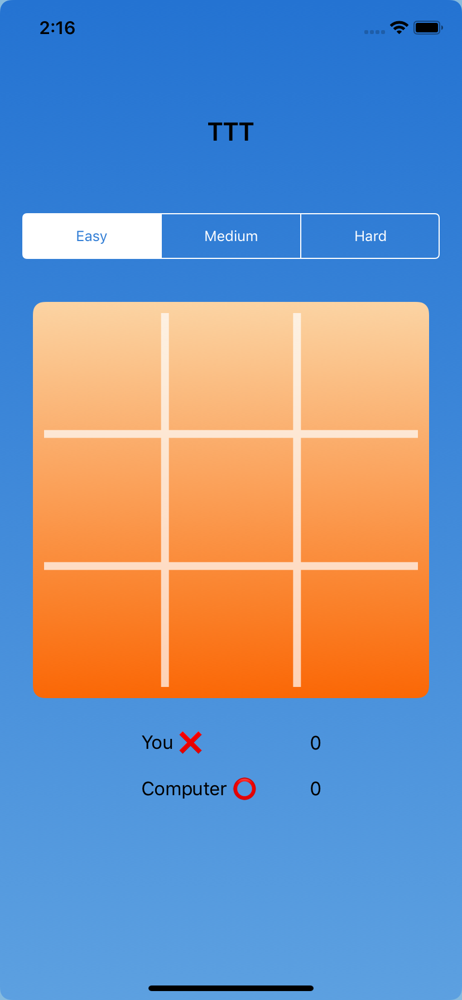
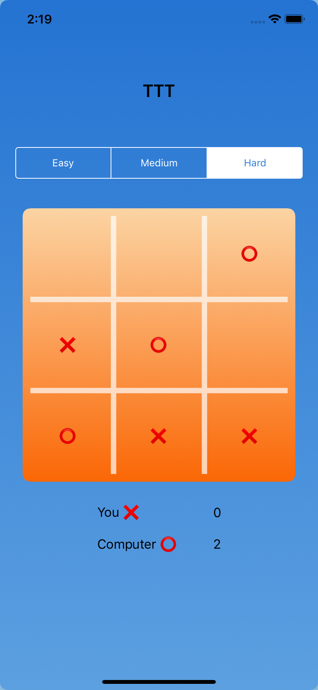
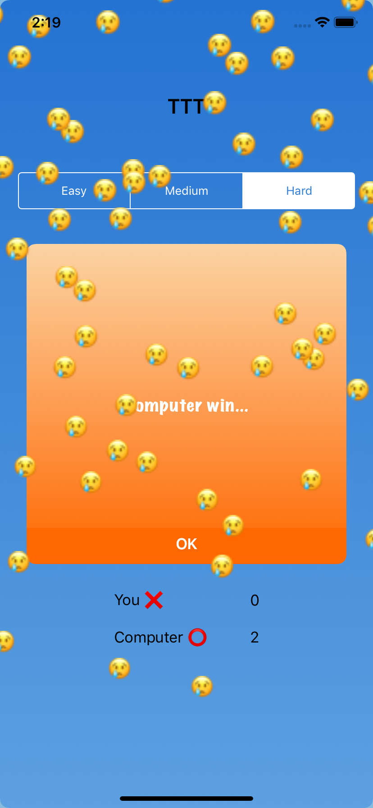

# TicTacToe 

A simple TicTacToe IOS Application Implemented in swift 5

<table>
  <tr>
    <td>
                   
    </td>
    <td>
         
    </td>
    <td>
        
    </td>
  </tr>
</table>
